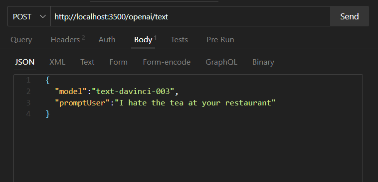

# OpenAI Proxy API Demo

This project demonstrates how to make API calls to the OpenAI API using a proxy server.

## Prerequisites

- Node.js (version X.X.X or higher)
- OpenAI API key (sign up at https://openai.com/)

## Installation

1. Clone the repository:

```shell 
git clone https://github.com/your-username/openai-proxy-demo.git
```

2. Navigate to the project directory:

```shell 
cd openai-proxy-demo
```

3. Install the dependencies:

```shell 
npm install
```

4. Set up your OpenAI API key:

   - Create a new file named `.env` in the project root directory.
   - Add the following line to the `.env` file:
   
   ```
   APIKEY = your-api-key
   ```

5. Start the server 

```shell
npm start
```
HOW TO MAKE AN API CALL 



